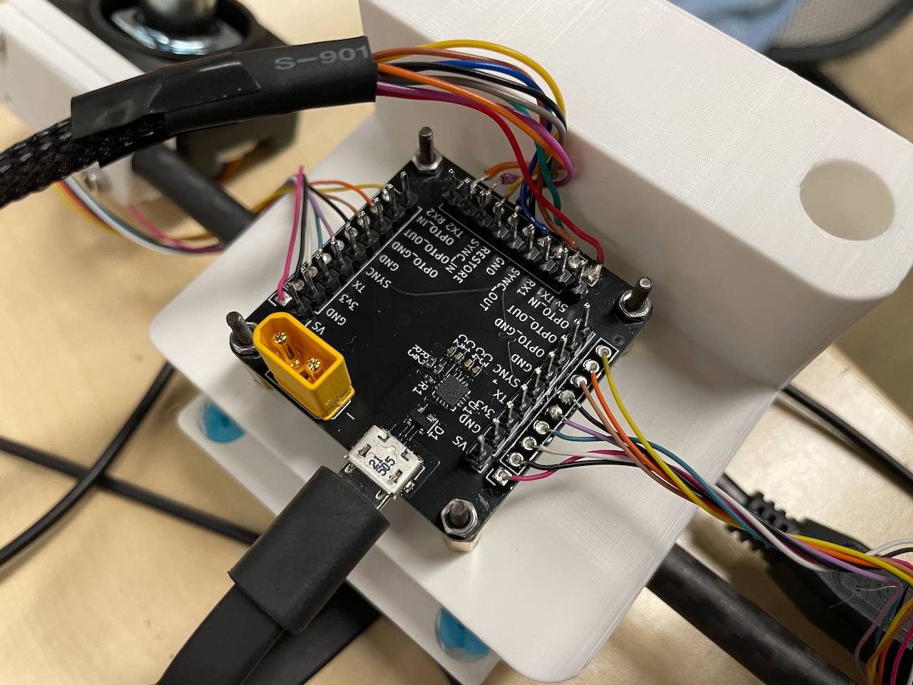

# ERL-VIO-Board
A small board intended for cleaning up the VIO sets, providing power options, and connecting the cameras and IMU.

# **WARNING**

**v1.0 has a silk screen error for the external supply port. - should be + and + should be -**

## Project Goal
Make it as easy and fast as possible to swap out cameras or IMU, and to diagnose problems.

## Features
- Verbose connectivity for IMU and cameras
- USB to UART bridge for IMU
- `SYNC` connection between IMU and cameras
- Optional external supply for cameras

## Improvements
- Power indicator LEDs
- Solder bridge between `RESTORE` and `GND`
## Errors
- External supply port polarity silk screen reversed
- `TX1` and `RX1` reversed